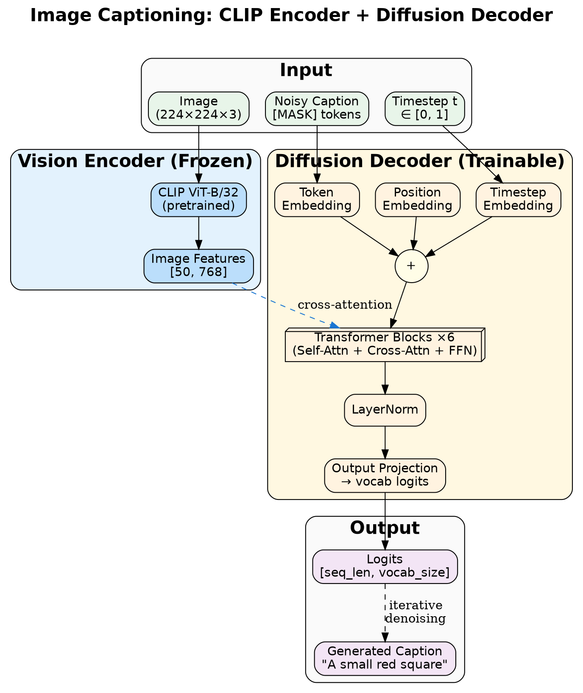
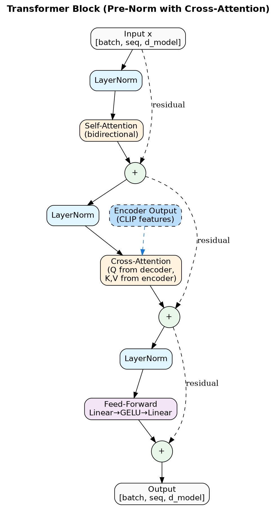
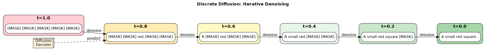

# diffusion-llm

A discrete diffusion language model built from scratch with PyTorch, trained on TinyStories, and extended to **image captioning** as proof-of-concept for Vision-Language-Action (VLA) models deployable on Jetson.

## Overview

Unlike autoregressive models (GPT-style) that generate text left-to-right, diffusion LMs start with masked tokens and iteratively "unmask" them using bidirectional context. This enables parallel generation and native infilling capabilities.

**Current Focus**: **Image-to-Text Captioning** using frozen CLIP vision encoder + discrete diffusion decoder. This demonstrates the multimodal architecture needed for VLA models while being tractable to train.

## Project Status

### ✅ Completed Phases

- [x] **Phase 1**: Data preparation (tokenizer, dataset processing)
- [x] **Phase 2**: Model architecture (bidirectional transformer, diffusion process)
- [x] **Phase 3**: Training loop (mixed precision, checkpointing)
- [x] **Phase 4**: Conditioning architecture (encoder, cross-attention, staged training)
  - [x] First sentence → story continuation
  - [x] First + last sentence → middle (infilling)
  - [x] Resume training from checkpoints
- [x] **Phase 5**: **Image Captioning**
  - [x] Synthetic data generation (colored shapes → captions)
  - [x] CLIP vision feature extraction
  - [x] Training script for image→text
  - [x] Generation/demo script
  - [x] POC training complete (5000 steps, 56M params, 96.7% accuracy)
  - [x] Validated on synthetic data (size/color detection working)
  - [x] COCO data pipeline ready (`prep_coco_data.py`)
  - [x] ONNX export for Jetson (`export_onnx.py`)

### 🔄 In Progress

- [ ] **Phase 5.2**: Train on real COCO images (118K examples)
- [ ] **Phase 5.3**: Benchmark BLEU/CIDEr scores (target: ~120 CIDEr)
- [ ] **Phase 5.4**: Implement DDCap techniques for competitive performance

### 🎯 Next Steps

- [ ] **Phase 5.5**: Scale to 150M params (xlarge config) for quality
- [ ] **Phase 5.6**: CIDEr-D optimization via REINFORCE (optional +10-15 points)
- [ ] **Phase 6**: Jetson optimization (TensorRT, quantization)
- [ ] **Phase 7**: VLA architecture (vision + language + action prediction)
- [ ] **Phase 8**: Custom CUDA kernels, diffusion optimizations

### 🎯 Performance Targets

| Milestone | CIDEr Target | Status |
|-----------|--------------|--------|
| Synthetic POC | N/A (96.7% acc) | ✅ Done |
| COCO Baseline | 100-110 | 🔄 Next |
| With DDCap techniques | 115-120 | Planned |
| Match DDCap paper | ~125 | Stretch |
| Best edge diffusion captioner | 120+ on Jetson | Goal |

## Quick Start

### Image Captioning (Current Focus)

```bash
# 1. Generate synthetic training data (5000 train, 500 val)
python prep_caption_synthetic.py --num_train 5000 --num_val 500

# 2. Train captioning model
python train_captioning.py \
    --data_dir data_captions_synthetic \
    --max_steps 5000 \
    --batch_size 64

# 3. Generate captions from validation set
python generate_caption.py \
    --checkpoint checkpoints_caption_poc/final.pt \
    --use_val_set \
    --num_samples 5 \
    --max_len 12

# 4. Generate caption from custom image
python generate_caption.py \
    --checkpoint checkpoints_caption_poc/final.pt \
    --image path/to/image.jpg \
    --num_samples 3
```

### Real Image Training (COCO)

```bash
# 1. Download and prepare COCO data (10K images)
python prep_coco_data.py --num_train 10000 --num_val 1000

# 2. Train on real images
python train_captioning.py \
    --data_dir data_coco \
    --max_steps 20000 \
    --batch_size 64
```

### Jetson Deployment

```bash
# Export model to ONNX
python export_onnx.py \
    --checkpoint checkpoints_caption_poc/final.pt \
    --output models/decoder.onnx \
    --test --benchmark

# On Jetson: convert to TensorRT (optional, for faster inference)
# trtexec --onnx=decoder.onnx --saveEngine=decoder.trt --fp16
```

### Text Generation (Baseline)

```bash
# Prepare TinyStories data
python data_prep.py

# Train unconditional model
python train.py --model_config small --max_steps 10000

# Generate samples
python generate.py --num_samples 5 --temperature 0.8

# Run tests
pytest -v
```

### Conditional Text Generation

```bash
# Prepare paired data (first sentence → rest of story)
python prep_conditional_data.py

# Train conditional model
python train_conditional.py \
    --denoiser checkpoints_long/final.pt \
    --max_steps 10000

# Generate conditional samples
python generate_conditional.py \
    --checkpoint checkpoints_conditional/best.pt \
    --prompt "Once upon a time there was a brave knight."
```

## Architecture

### Image Captioning Model



**Vision Encoder** (frozen):
- CLIP ViT-B/32 (pretrained, 50 patches, 768-dim)
- Extracts rich visual features from images
- No training required (use pretrained weights)

**Diffusion Decoder** (trainable):
- 6-layer bidirectional transformer (56M params)
- Cross-attention layers condition on image features
- Iterative denoising from all-mask to coherent caption
- 768-dim to match CLIP feature dimension

**Training**:
- Only decoder is trained (CLIP frozen)
- Cosine noise schedule for smooth masking
- Cross-entropy loss on masked token prediction
- AdamW optimizer with warmup

### Transformer Block Detail



Each transformer block uses pre-norm architecture with:
- **Self-Attention**: Bidirectional attention over caption tokens
- **Cross-Attention**: Attends to CLIP image features (K,V from encoder)
- **Feed-Forward**: Linear → GELU → Linear expansion
- **Residual connections** around each sub-layer

### Diffusion Process



Generation proceeds by iterative denoising:
1. Start with all `[MASK]` tokens (t=1.0)
2. Model predicts token probabilities at each position
3. Gradually unmask tokens based on confidence
4. Final caption emerges at t=0.0

```python
# Architecture
image = load_image("photo.jpg")
image_features = clip_encoder(image)  # [1, 50, 768] - frozen

caption_tokens = all_masks  # Start with [MASK] tokens
for t in timesteps:
    logits = decoder(
        caption_tokens, t,
        encoder_output=image_features  # Condition on image
    )
    caption_tokens = unmask_some_tokens(logits, t)

caption = tokenizer.decode(caption_tokens)
```

### Visualize Architecture

```bash
# Generate architecture diagrams
python visualize_architecture.py

# Include detailed computation graph
python visualize_architecture.py --detailed
```

### Text Model (Baseline)

**DiffusionTransformer** (`model.py`):
- Bidirectional transformer with no causal masking
- Sinusoidal timestep embeddings
- Pre-norm transformer blocks
- Configurable sizes (tiny → xxlarge)

**DiscreteDiffusion** (`diffusion.py`):
- Cosine noise schedule for smooth masking
- Forward process: progressively mask tokens
- Reverse process: iteratively unmask via model predictions

### DDCap Techniques (Planned)

Based on [DDCap](https://arxiv.org/abs/2211.11694) which achieves ~125 CIDEr with discrete diffusion:

| Technique | Description | Status | Expected Gain |
|-----------|-------------|--------|---------------|
| **Concentrated Attention Mask** | Text tokens ignore [MASK] during self-attention; [MASK] tokens ignore other [MASK] tokens | Planned | +3-5 CIDEr |
| **Best-First Inference** | Lock in top-K confident predictions each step, never re-mask them | Planned | +2-3 CIDEr |
| **Length Prediction** | MLP predicts caption length from [CLS] before generation | Planned | +1-2 CIDEr |
| **Image-Free Training** | 20% of batches use learned embeddings instead of images | Planned | +1-2 CIDEr |
| **Direct x₀ Prediction** | Predict clean tokens directly (not noise) | ✅ Already used | Baseline |

**Why these help:**
- Concentrated attention prevents noise from corrupting good predictions
- Best-first avoids "contamination" where confident tokens get re-masked
- Length prediction eliminates padding artifacts
- Image-free training improves text fluency/grammar

## Training Results

### Image Captioning (Synthetic POC Complete)

| Metric | Value |
|--------|-------|
| Model | 6-layer decoder (56M params) |
| Data | 5000 synthetic images (colored shapes) |
| Target | "A small red square", "A large blue circle", etc. |
| Training steps | 5000 |
| Final accuracy | 96.7% |
| Training time | ~5 hours (CPU) |

**Results**: Model correctly identifies size (large/small) and color with high accuracy. Shape discrimination is limited due to CLIP's training on natural images rather than simple geometric shapes.

**Sample outputs**:
| Ground Truth | Generated |
|-------------|-----------|
| A large orange rectangle | This is a large orange rectangle |
| There is a small yellow triangle | There is a small yellow rectangle |
| A small pink circle | There is a small pink rectangle |

**Next step**: Train on COCO real images where CLIP features are more discriminative.

### Text Generation (Baseline)

| Metric | Value |
|--------|-------|
| Model | small (17M params) |
| Dataset | TinyStories (2.1M stories) |
| Training steps | 12,500 |
| Final val loss | 3.24 |
| Final val accuracy | 39.1% |
| Training time | ~15 hours (CPU) |

**Sample output:**
> Once upon a time, there was a little ant. He decided to go on the icy leaves around. Suddenly, he bumped from his grass. The door popped, a huge pot came to the cave. The bird looked around and saw a little girl...

## Model Configurations

| Config  | d_model | Heads | Layers | Parameters | Use Case |
|---------|---------|-------|--------|------------|----------|
| tiny    | 256     | 4     | 4      | ~4.5M      | Debugging |
| small   | 384     | 6     | 6      | ~15M       | Prototyping |
| medium  | 512     | 8     | 8      | ~35M       | Production |
| large   | 640     | 10    | 10     | ~60M       | Best quality |
| xlarge  | 768     | 12    | 12     | ~110M      | Jetson target |

**Captioning model**: Uses 768-dim (xlarge size) to match CLIP feature dimension, but only 6 layers (56M params).

## Testing

```bash
# Run all tests
pytest -v

# Run with coverage
pytest --cov=. --cov-report=term-missing

# Run specific test suite
pytest test_captioning.py -v
```

**Current coverage: 94% (421 tests passing)**

| Module | Coverage | Description |
|--------|----------|-------------|
| `diffusion.py` | 100% | Core diffusion logic |
| `generate_caption.py` | 100% | Image caption generation |
| `visualize_architecture.py` | 100% | Architecture diagrams |
| `train_config_long.py` | 100% | Config handling |
| `train_conditional_overnight.py` | 100% | Training scripts |
| `export_onnx.py` | 99% | ONNX export for Jetson |
| `prep_coco_data.py` | 99% | COCO data preparation |
| `prep_caption_synthetic.py` | 99% | Synthetic data generation |
| `evaluate.py` | 98% | Metrics and evaluation |
| `generate_conditional.py` | 98% | Text generation |
| `model.py` | 97% | Transformer architecture |
| `data_prep.py` | 96% | Data processing |
| `generate.py` | 95% | Unconditional generation |
| `train_long.py` | 93% | Long training runs |
| `train_captioning.py` | 91% | Image captioning training |
| `train_conditional.py` | 89% | Conditional training |
| `prep_conditional_data.py` | 88% | Data preparation |
| `train.py` | 87% | Main training loop |

## Hardware Targets

- **Training**: CPU (current), Desktop GPU (future)
- **Inference**: Jetson Orin Nano 8GB (target deployment)

## Path to VLA (Vision-Language-Action)

**VLA = Vision Encoder + Language Model + Action Decoder**

Current progress toward VLA:

| Component | Status | Implementation |
|-----------|--------|----------------|
| **Vision Encoder** | ✅ Done | CLIP ViT-B/32 (frozen) |
| **Language Model** | ✅ Done | Discrete diffusion decoder |
| **Cross-Modal Fusion** | ✅ Done | Cross-attention conditioning |
| **Action Decoder** | ⏸️ Future | Policy network (MLP/transformer) |
| **End-to-End Training** | ⏸️ Future | Joint optimization |

**Current work**: Image captioning validates the vision+language architecture. Next step is adding action prediction head for robotics applications (e.g., "pick up red cup" → gripper actions).

## Roadmap to Deployment

### Near-term: Competitive Captioning (Phase 5)
1. ✅ Synthetic data POC (5K examples, 96.7% accuracy)
2. 🔄 COCO baseline (118K images, 56M params) → target 100-110 CIDEr
3. [ ] Implement DDCap techniques (concentrated attention, best-first)
4. [ ] Scale to 150M params (xlarge config) → target 115-120 CIDEr
5. [ ] Benchmark with official COCO eval (pycocoevalcap)
6. [ ] Optional: CIDEr-D optimization via REINFORCE → +10-15 CIDEr

### Medium-term: Optimize for Jetson
1. ✅ ONNX export (~13ms/step on CPU)
2. [ ] TensorRT optimization
3. [ ] INT8/FP16 quantization
4. [ ] Memory profiling on Jetson Orin Nano
5. [ ] Inference latency benchmarks

### Long-term: VLA for Robotics
1. [ ] Add action prediction head
2. [ ] Collect/simulate robot demonstration data
3. [ ] Train vision→language→action pipeline
4. [ ] Deploy on Jetson-powered robot
5. [ ] Real-world testing

## Project Structure

```
diffusion-llm/
├── model.py                    # Transformer architecture
├── diffusion.py                # Discrete diffusion process
├── train.py                    # Training loop (unconditional)
├── train_captioning.py         # Image captioning training
├── train_conditional.py        # Conditional text generation
├── generate.py                 # Text generation
├── generate_caption.py         # Image caption generation
├── generate_conditional.py     # Conditional text generation
├── prep_caption_synthetic.py   # Synthetic caption data
├── prep_coco_data.py           # COCO real image data preparation
├── export_onnx.py              # ONNX export for Jetson deployment
├── visualize_architecture.py   # Architecture diagram generation
├── data_prep.py                # TinyStories data preparation
├── evaluate.py                 # Evaluation metrics
├── test_*.py                   # Test suite (421 tests, 94% coverage)
├── docs/                       # Architecture diagrams
├── models/                     # Exported ONNX models
├── deprecated/                 # Experimental/deprecated code
├── checkpoints_caption_poc/    # Captioning checkpoints
├── data_captions_synthetic/    # Synthetic image-caption pairs
└── data_full/                  # TinyStories tokenized data
```

## Related Work & Inspirations

**Discrete Diffusion Models**:
- [MDLM](https://arxiv.org/abs/2406.07524) - Masked Diffusion Language Model
- [D3PM](https://arxiv.org/abs/2107.03006) - Discrete Denoising Diffusion
- [Diffusion-LM](https://arxiv.org/abs/2205.14217) - Continuous diffusion for text

**Diffusion Image Captioning** (primary references for this project):
- [DDCap](https://arxiv.org/abs/2211.11694) - Discrete diffusion for captioning (~125 CIDEr, 280M params)
- [LaDiC](https://arxiv.org/abs/2404.10763) - Latent diffusion captioner (~126 CIDEr, SOTA for diffusion)
- [SST](https://arxiv.org/abs/2512.10038) - Show, Suggest and Tell hybrid approach

**Vision-Language Models**:
- [Flamingo](https://arxiv.org/abs/2204.14198) - Few-shot vision-language learning
- [CLIP](https://arxiv.org/abs/2103.00020) - Contrastive vision-language pretraining
- [BLIP](https://arxiv.org/abs/2201.12086) - Bootstrapped captioning with CapFilt
- [BLIP-2](https://arxiv.org/abs/2301.12597) - Q-Former bridge to frozen LLMs
- [CoCa](https://arxiv.org/abs/2205.01917) - Contrastive captioning

**VLA Models**:
- [RT-2](https://arxiv.org/abs/2307.15818) - Vision-Language-Action model for robotics
- [OpenVLA](https://arxiv.org/abs/2406.09246) - Open source VLA

## Future Extensions

### Optimization (Phase 6)
- [ ] Custom CUDA kernels for fused attention
- [ ] FlashAttention integration
- [ ] KV-cache for faster inference
- [ ] Speculative decoding

### Architecture (Phase 7)
- [ ] Block Diffusion for streaming generation
- [ ] LoRA for parameter-efficient fine-tuning
- [ ] Mixture of Experts (MoE)
- [ ] Retrieval-augmented generation

### Applications (Phase 8)
- [ ] Robot control (action prediction)
- [ ] Image editing (inpainting)
- [ ] Video captioning
- [ ] Multi-modal dialogue

## Why This Matters

**Discrete diffusion + multimodal = powerful combination:**

1. **Parallel generation**: Faster than autoregressive (important for robotics)
2. **Bidirectional context**: Better understanding of both vision and language
3. **Flexible conditioning**: Easy to add image, video, or sensor inputs
4. **Jetson-compatible**: Model size designed for edge deployment

**Goal**: Open-source VLA model that runs efficiently on affordable edge hardware (Jetson Orin Nano), enabling practical robotics applications.

## License

MIT

## Contributing

This is a research project and portfolio piece. Feel free to open issues or PRs for:
- Bug fixes
- Performance improvements
- New features (especially Jetson optimization)
- Documentation improvements

## Citation

If you use this code, please cite:

```bibtex
@software{diffusion_llm_2026,
  author = {Adam A Holmes},
  title = {diffusion-llm: Discrete Diffusion for Image Captioning and VLA},
  year = {2026},
  url = {https://github.com/aaholmes/diffusion-llm}
}
```
