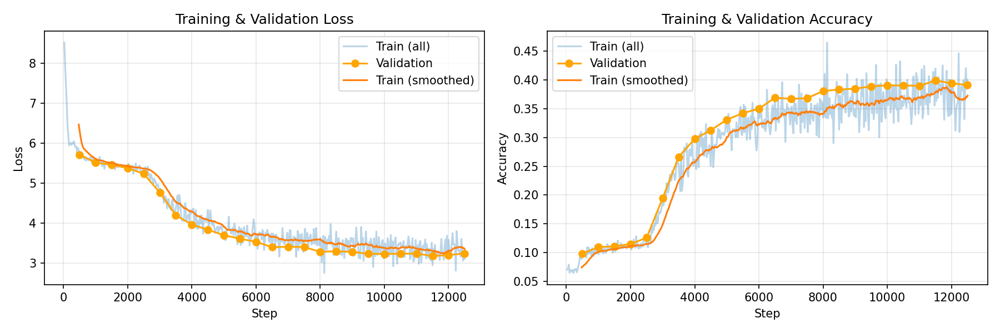

# diffusion-llm

A discrete diffusion language model built from scratch with PyTorch, trained on TinyStories and optimized for Jetson Orin Nano deployment.

## Overview

Unlike autoregressive models (GPT-style) that generate text left-to-right, diffusion LMs start with masked tokens and iteratively "unmask" them using bidirectional context. This enables parallel generation and native infilling capabilities.

## Project Status

- [x] **Phase 1**: Data preparation (tokenizer, dataset processing)
- [x] **Phase 2**: Model architecture (bidirectional transformer, diffusion process)
- [x] **Phase 3**: Training loop (mixed precision, checkpointing, wandb)
- [x] **Phase 4**: Conditioning architecture (encoder, cross-attention, staged training)
- [x] **Phase 4.5**: First successful training run on full dataset
- [ ] **Phase 5**: Jetson optimization
- [ ] **Phase 6**: Extensions (multimodal, LoRA, custom CUDA kernels)

## Training Results

First successful training run on TinyStories (2.1M stories):

| Metric | Value |
|--------|-------|
| Model | small (17M params) |
| Training steps | 12,500 |
| Final val loss | 3.24 |
| Final val accuracy | 39.1% |
| Training time | ~15 hours (CPU) |
| Overfitting | None (val ≈ train) |



**Sample output:**
> Once upon a time, there was a little ant. He decided to go on the icy leaves around. Suddenly, he bumped from his grass. The door popped, a huge pot came to the cave. The bird looked around and saw a little girl...

The model learns TinyStories vocabulary, grammar, and narrative structure. Coherence is limited by model size (17M) and the parallel generation nature of diffusion models.

## Quick Start

```bash
# Install dependencies
pip install -r requirements.txt

# Prepare data (downloads TinyStories, trains tokenizer, tokenizes dataset)
python data_prep.py

# Train model
python train.py --model_config small --max_steps 10000

# Generate samples
python generate.py --num_samples 5 --temperature 0.8

# Run tests
pytest -v
```

### Long Training Run

For a full training run on the complete TinyStories dataset:

```bash
# Prepare full dataset (2.1M stories, ~10 min)
python train_long.py --skip_data_prep  # if data_full/ exists
python train_long.py                    # full pipeline

# Generate from trained model
python generate.py --checkpoint checkpoints_long/final.pt

# Evaluate model (perplexity, BLEU)
python evaluate.py --checkpoint checkpoints_long/final.pt
```

### Conditional Training (Coming Soon)

```bash
# Prepare paired data (first sentence -> rest of story)
python prep_conditional_data.py
```

## Architecture

**DiffusionTransformer** (`model.py`):
- Bidirectional transformer with no causal masking
- Sinusoidal timestep embeddings
- Pre-norm transformer blocks
- Configurable sizes (tiny → large)

**DiscreteDiffusion** (`diffusion.py`):
- Cosine noise schedule for smooth masking
- Forward process: progressively mask tokens
- Reverse process: iteratively unmask via model predictions

**Trainer** (`train.py`):
- AdamW optimizer with linear warmup + cosine decay
- Mixed precision training (FP16)
- Gradient accumulation and clipping
- Automatic checkpointing with best model tracking
- Optional Weights & Biases logging

## Model Configurations

| Config  | d_model | Heads | Layers | Parameters | Use Case |
|---------|---------|-------|--------|------------|----------|
| tiny    | 256     | 4     | 4      | ~4.5M      | Debugging |
| small   | 384     | 6     | 6      | ~15M       | Prototyping |
| medium  | 512     | 8     | 8      | ~35M       | Production |
| large   | 640     | 10    | 10     | ~60M       | Best quality |
| xlarge  | 768     | 12    | 12     | ~110M      | Jetson (~1.2s) |
| xxlarge | 1024    | 16    | 16     | ~250M      | Jetson (~2.0s) |

## Hardware Targets

- **Training**: Desktop GPU (RTX 5060 Ti 16GB)
- **Inference**: Jetson Orin Nano 8GB

## Testing

```bash
# Run all tests
pytest -v

# Run with coverage
pytest --cov=. --cov-report=term-missing
```

**Current coverage: 89% (273 tests passing)**

| Module | Coverage |
|--------|----------|
| `diffusion.py` | 100% |
| `train_config_long.py` | 100% |
| `model.py` | 97% |
| `data_prep.py` | 96% |
| `generate.py` | 95% |
| `prep_conditional_data.py` | 88% |
| `evaluate.py` | 87% |
| `train.py` | 87% |

## Conditioning Architecture

Phase 4 adds encoder-decoder conditioning for controlled generation:

- **TextEncoder**: Bidirectional transformer encoding input text
- **Cross-Attention**: Decoder attends to encoder output (original Transformer style)
- **Staged Training**: Train denoiser → freeze → train encoder + cross-attention
- **Data Pipeline**: Extract (first sentence → rest of paragraph) pairs

```python
from model import create_conditional_model

# Create encoder-decoder model
model = create_conditional_model(
    encoder_config="small",
    decoder_config="small",
    vocab_size=8192,
)

# Stage 2: Freeze decoder, train only encoder + cross-attention
model.freeze_decoder()
```

## Next Steps

### Near-term (GPU training)
- [ ] Train larger models (medium 35M, large 60M) with GPU
- [ ] Experiment with more diffusion steps at inference (200-500)
- [ ] Train conditional model (first sentence → story continuation)
- [ ] Hyperparameter tuning (learning rate, batch size, warmup)

### Medium-term (Jetson deployment)
- [ ] ONNX export and TensorRT optimization
- [ ] Quantization (INT8/FP16) for inference
- [ ] Memory profiling on Jetson Orin Nano
- [ ] Benchmark inference latency vs quality tradeoffs

### Long-term (Extensions)
- [ ] **LoRA for vision**: Add image conditioning with low-rank adapters
- [ ] **Block Diffusion**: Implement [Block Diffusion](https://arxiv.org/abs/2503.09573) for streaming generation
- [ ] **Custom CUDA kernels**: Fused attention for faster inference

## Future: Block Diffusion

Long-term stretch goal: implement [Block Diffusion](https://arxiv.org/abs/2503.09573) (ICLR 2025 Oral) which interpolates between autoregressive and diffusion models:

- **Block-wise generation**: Divide sequence into blocks, generate blocks autoregressively, diffuse within each block
- **Arbitrary length**: No fixed sequence length limitation
- **KV caching**: Cache across blocks for faster inference
- **Tunable tradeoff**: Block size controls quality vs speed

This would combine parallel generation (fast) with streaming output (responsive UX) — ideal for Jetson deployment.
